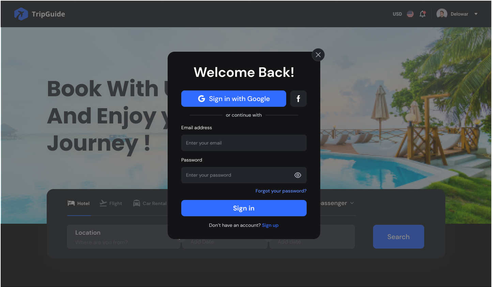
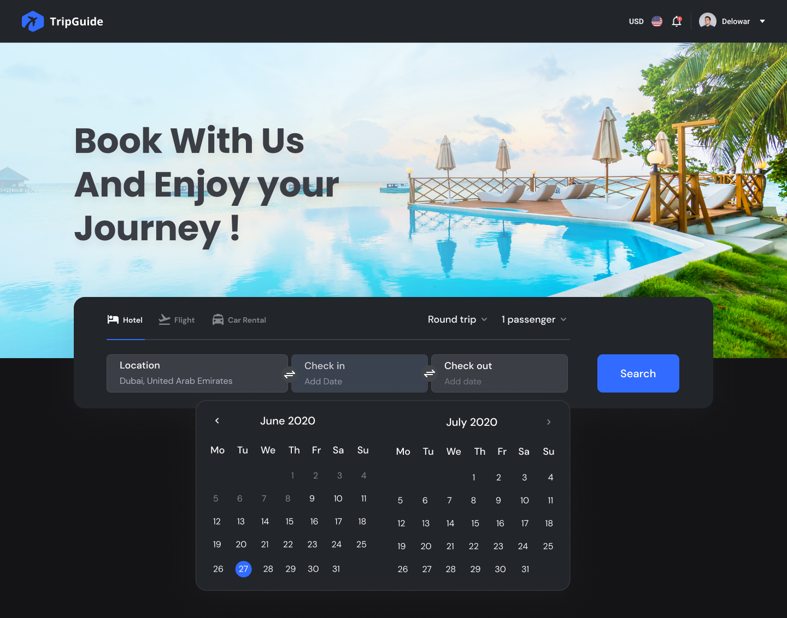
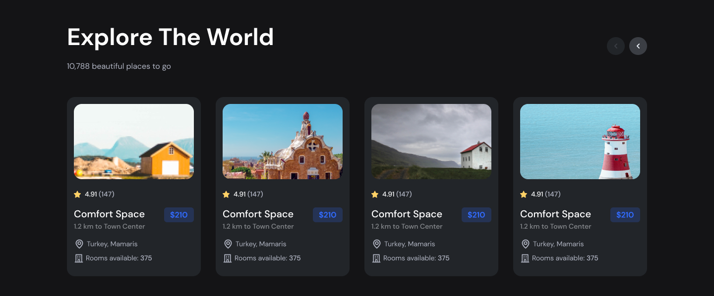
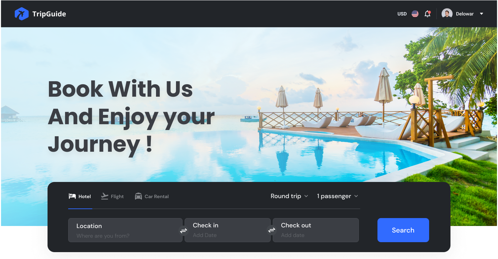
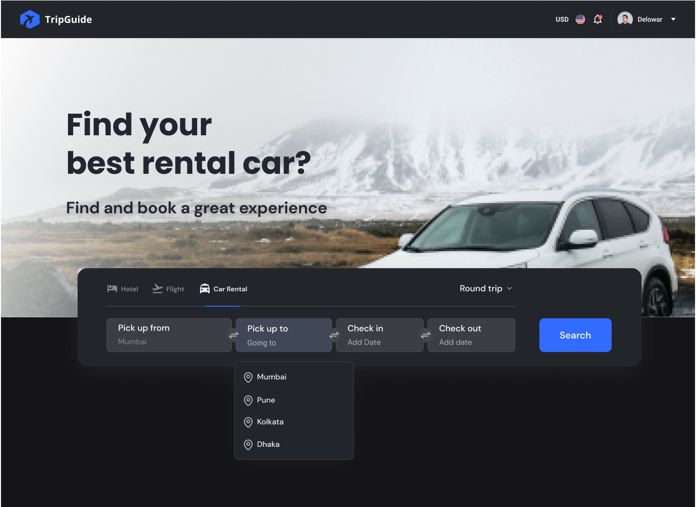
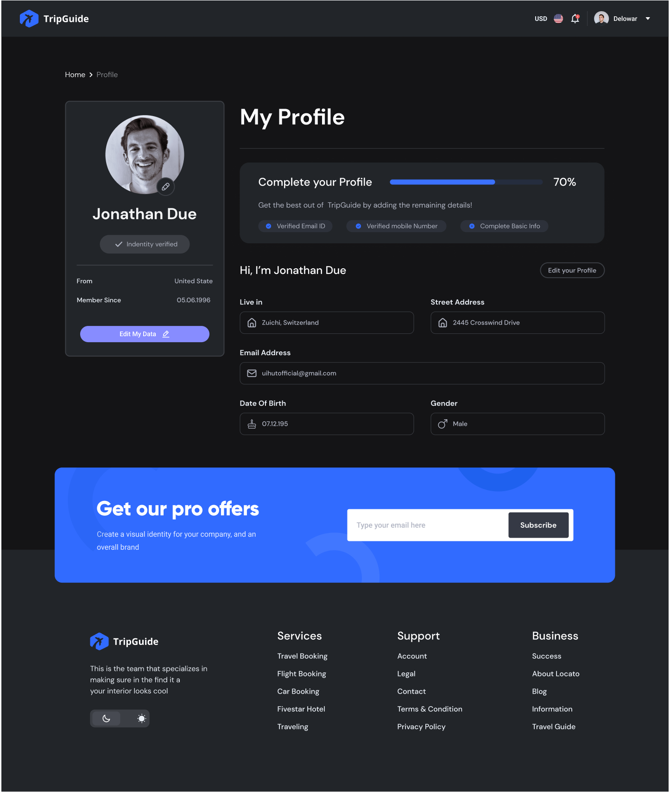
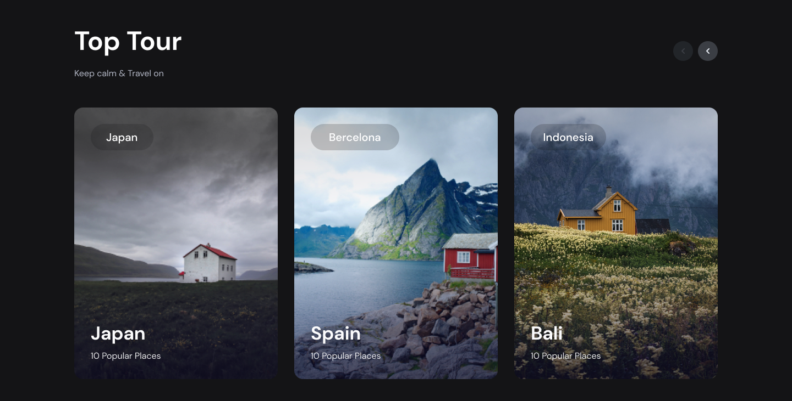

<div align="center">

  
  <h1>Tripguide</h1>
  
  <p>
    Capstone Project for JSM Masterclass 2022 
  </p>
  
  
<h4>
    <a href="https://tripguide-capstone-jsm.vercel.app/" target="blank">View Demo</a>
    <span> · </span>
  </h4>
</div>

<br />

<!-- Table of Contents -->
# :notebook_with_decorative_cover: Table of Contents

- [:notebook\_with\_decorative\_cover: Table of Contents](#notebook_with_decorative_cover-table-of-contents)
  - [:star2: About the Project](#star2-about-the-project)
    - [:camera: Screenshots](#camera-screenshots)
    - [:space\_invader: Tech Stack](#space_invader-tech-stack)
    - [:art: Color Reference](#art-color-reference)
    - [:key: Environment Variables](#key-environment-variables)
  - [:toolbox: Getting Started](#toolbox-getting-started)
    - [:gear: Installation](#gear-installation)
    - [:running: Run Locally](#running-run-locally)
  - [:warning: License](#warning-license)

  

<!-- About the Project -->
## :star2: About the Project


<!-- Screenshots -->
### :camera: Screenshots

<div align="center"> 
  
  
  
  
  
  
  
  
  
  
</div>


<!-- TechStack -->
### :space_invader: Tech Stack

  <ul>
    <li><a href="https://www.typescriptlang.org/">Typescript</a></li>
    <li><a href="https://nextjs.org/">Next.js</a></li>
    <li><a href="https://reactjs.org/">React.js</a></li>
    <li><a href="https://tailwindcss.com/">TailwindCSS</a></li>
    <li><a href="https://redux-toolkit.js.org/">Redux Toolkit</a></li>
    <li><a href="https://prisma.io/">Prisma</a></li> 
  </ul>


<!-- Color Reference -->
### :art: Color Reference

| Color             | Hex                                                                |
| ----------------- | ------------------------------------------------------------------ |
| Primary Color |  #316BFF |
| Secondary Color |  #FF543D |
| Accent Color |  #F4F5F6 |
| Text Color |  #EEEEEE |

<!-- Env Variables -->
### :key: Environment Variables
<a href="/.env.example">Env Example</a>


<!-- Getting Started -->
## 	:toolbox: Getting Started

<!-- Installation -->
### :gear: Installation

Install with npm

```bash
  npm i
```
   

<!-- Run Locally -->
### :running: Run Locally

Clone the project

```bash
  git clone https://github.com/Abil-Shrestha/Tripguide_Capstone_JSM.git
```

Go to the project directory

```bash
  cd tripguide
```

Install dependencies

```bash
  npm install
```

Start the server

```bash
  npm run dev 
```


<!-- License -->
## :warning: License

Copyright 2023 Abil Shrestha

Licensed under the Apache License, Version 2.0 (the "License"); you may not use this file except in compliance with the License. You may obtain a copy of the License at
http://www.apache.org/licenses/LICENSE-2.0

Unless required by applicable law or agreed to in writing, software distributed under the License is distributed on an "AS IS" BASIS, WITHOUT WARRANTIES OR CONDITIONS OF ANY KIND, either express or implied. See the License for the specific language governing permissions and limitations under the License.
